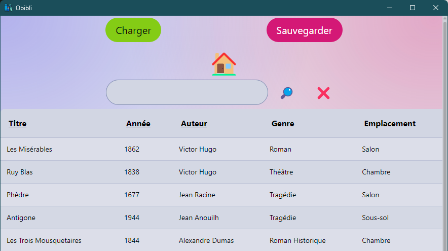

# Obibli - Your local lightweight library

  

## About Obibli

Obibli is a simple, lightweight, local library management application built with [Tauri](https://tauri.app/), [Rust](https://www.rust-lang.org/) and [Sveltekit](https://kit.svelte.dev/). It allows you to add, edit, manage your books in an intuitive interface. With a powerful search feature and fast sorting, Obibli aims to provide a seamless experience for managing your personal home library.

Note that due to Obibli being a personal project of mine, the interface is only available in french for now.
